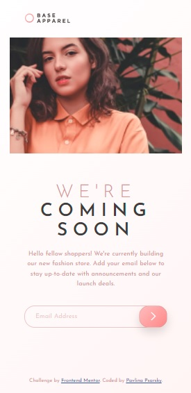

# Frontend Mentor - Base Apparel coming soon page solution

This is a solution to the [Base Apparel coming soon page challenge on Frontend Mentor](https://www.frontendmentor.io/challenges/base-apparel-coming-soon-page-5d46b47f8db8a7063f9331a0). Frontend Mentor challenges help you improve your coding skills by building realistic projects. 

## Table of contents

- [Overview](#overview)
  - [The challenge](#the-challenge)
  - [Screenshot](#screenshot)
  - [Links](#links)
- [My process](#my-process)
  - [Built with](#built-with)
  - [What I learned](#what-i-learned)
  - [Continued development](#continued-development)
  - [Useful resources](#useful-resources)
- [Author](#author)
- [Acknowledgments](#acknowledgments)

## Overview

### The challenge

Users should be able to:

- View the optimal layout for the site depending on their device's screen size
- See hover states for all interactive elements on the page
- Receive an error message when the `form` is submitted if:
  - The `input` field is empty
  - The email address is not formatted correctly

### Screenshot

| Desktop layout |
|:--:|


| Mobile layout |
|:--:|


### Links

- Solution URL: https://github.com/PavlinaPs/base-apparel-coming-soon
- Live Site URL: https://pavlinaps.github.io/base-apparel-coming-soon/

## My process

### Built with

- Semantic HTML5 markup
- Sass
- CSS Grid
- Mobile-first workflow

### What I learned

#### Sass

This is my first challenge using Sass. The first set-up was a little confusing mainly because of @import being deprecated and soon dropped, I wanted to get it right from the start. I think I figured it out, with the help of:
- freeCodeCamp's [Sass Tutorial for Beginners - CSS With Superpowers](https://youtu.be/_a5j7KoflTs)
- Kevin Powell's video [Stop using @import with Sass | @use and @forward explained](https://youtu.be/_a5j7KoflTs)

But I don't know if I am deploying it right.

#### E-mail address validation

I used a RegEx from w3resource: [JavaScript: HTML Form - email validation](https://www.w3resource.com/javascript/form/email-validation.php).

I needed to look up JavaScript - DOM manipulation of placeholder input. This WDS video tutorial helped me: [JavaScript Form Validation](https://youtu.be/In0nB0ABaUk).

I also needed to remove default browser e-mail validation error messages. It is easy: 
```html
<form id="form" action="#" novalidate>
```
I found it on Stack Overflow: [How to prevent the default browser input validation?](https://stackoverflow.com/questions/17997212/how-to-prevent-the-default-browser-input-validation)

#### Submit button filter
I wanted the button to stand out on hover and while error message is displayed as per design, solved it with a filter on top of box shadow. I used the first color from second gradient.
```css
.submit:hover, .submit[data-error=true] {
  ...
  box-shadow: 0 10px 10px rgba(0, 0, 0, 0.15);
  filter: drop-shadow(0px 10px 10px hsl(0deg, 80%, 86%));
  background-image: url(../../images/icon-arrow.svg);
}
```
More on filters here: [Filter property on MDN](https://developer.mozilla.org/en-US/docs/Web/CSS/filter#specifications)

### Continued development

I need to practice more JavaScript. And get much faster.

### Useful resources

The links are added in the text of [What I learned](#what-i-learned), respectively to the topic.

## Author

- GitHub - [PavlinaPs](https://github.com/PavlinaPs)
- Frontend Mentor - [@PavlinaPs](https://www.frontendmentor.io/profile/PavlinaPs)

## Acknowledgments

It is great that I can solve Frontend Mentor challenges. They are all very useful for me. Also the video tutorials of freeCodeCamp, Kevin Powell and WDS are very useful. Thank you!